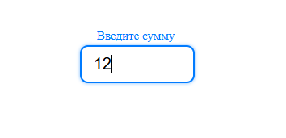

# Проект DivanRuContest

## Описание

task1 - резиновая верстка

task2 создан для участия в конкурсе DivanRu. Он содержит компонент `PriceInput`, который позволяет вводить сумму в заданном диапазоне.

## Установка task2

1. Клонируйте репозиторий:
   ```sh
   git clone https://github.com/MorgV/DivanRuContest.git
   ```
2. Перейдите в папку с проектом:
   ```sh
   cd task2
   ```
3. Установите зависимости:
   ```sh
   npm install
   ```
4. Запустите проект:
   ```sh
   npm run dev
   ```

## Установка task1

1. Клонируйте репозиторий:
   ```sh
   git clone https://github.com/MorgV/DivanRuContest.git
   ```
2. Перейдите в папку с проектом:
   ```sh
   cd task1
   ```
3. Запустите с помощью Live Server:
   ```sh
   https://www.npmjs.com/package/live-server
   ```

## Screens

# task1



# task2


